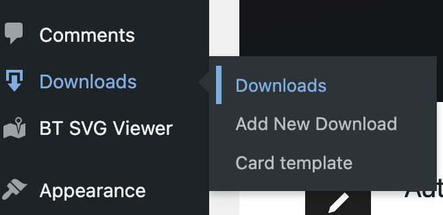
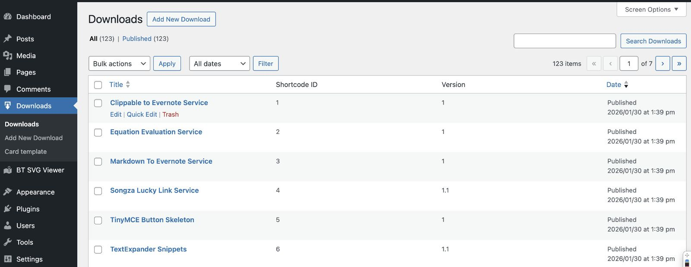
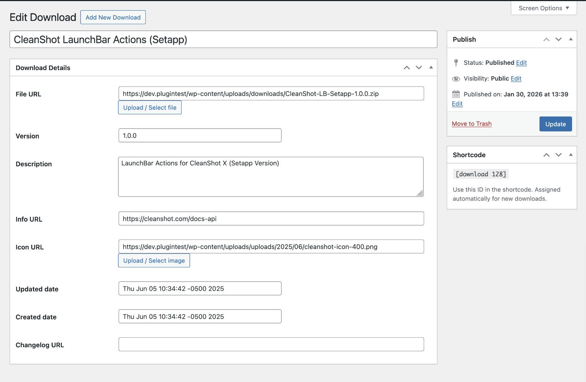
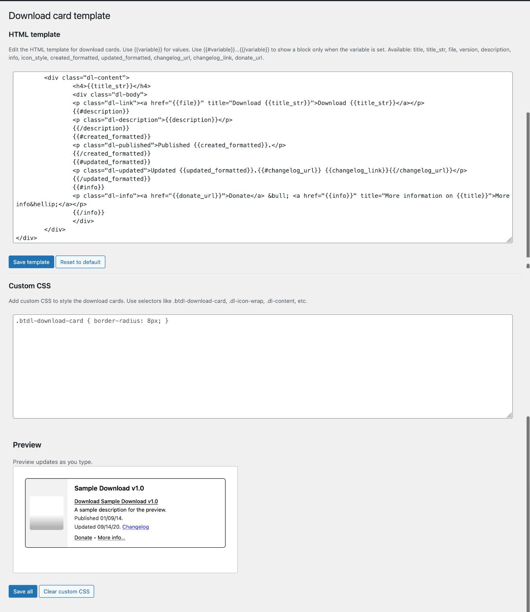
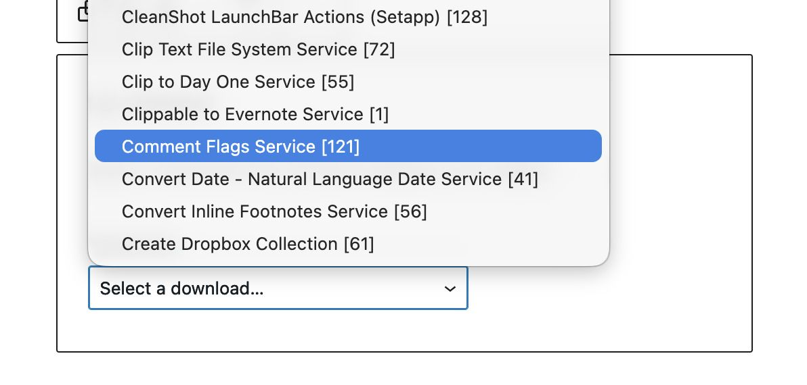
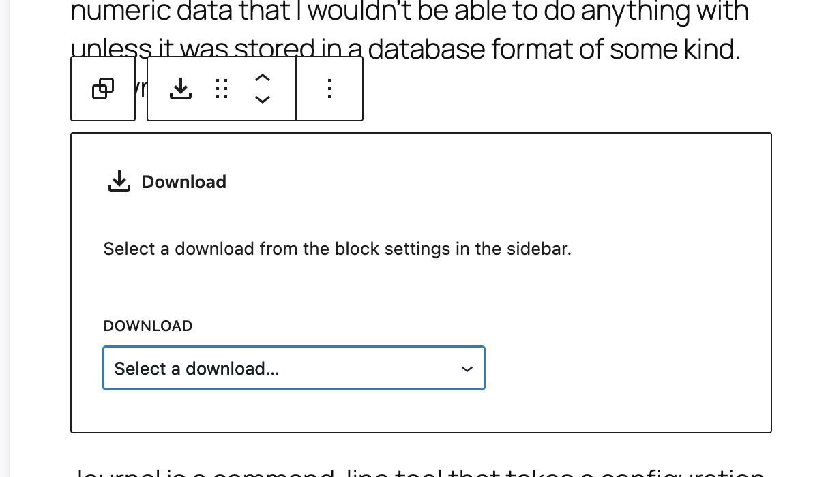
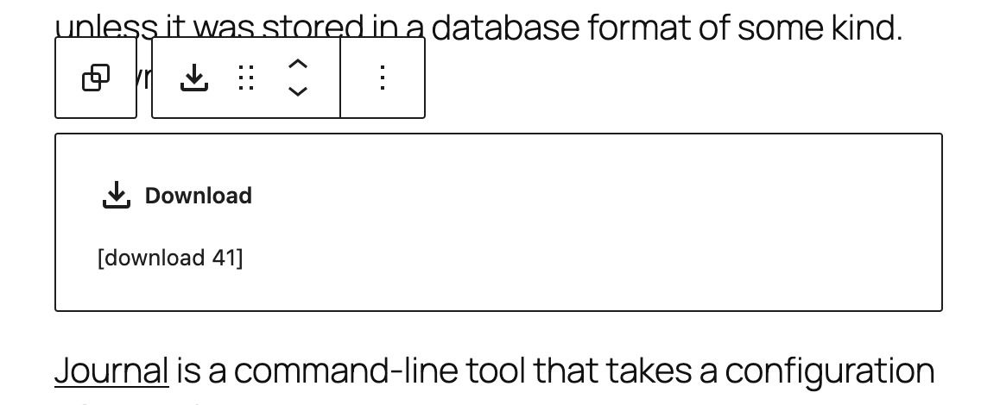
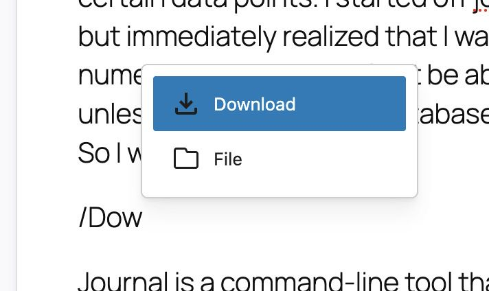
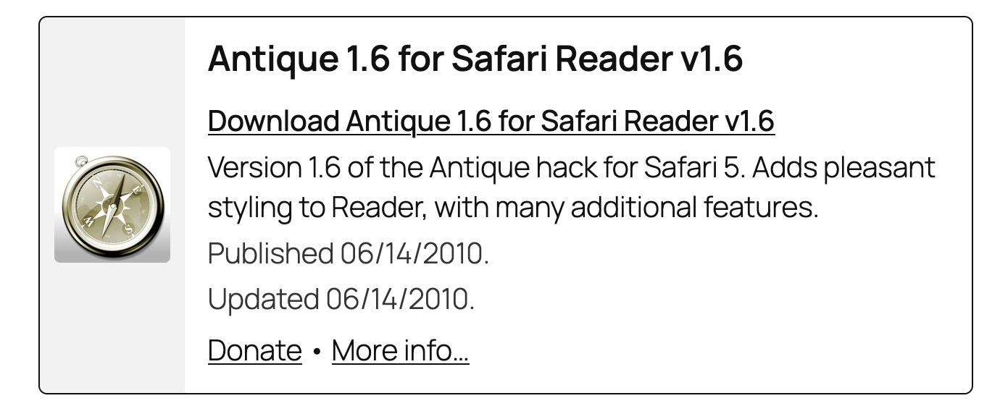

**Requires:** WordPress 5.8+, PHP 7.4+

## Features

- **Custom post type** for downloads: file URL, version, description, info link, icon, changelog
- **Editable HTML template** with Mustache-style conditionals (`{{#var}}...{{/var}}`)
- **Custom CSS** with live-updating preview
- **Upload buttons** for file and icon on the download edit screen (files go to `uploads/downloads/`)
- **Insert tools** for classic editor (TinyMCE button) and block editor (Download block)
- **WP-CLI import** from CSV: `wp btdl import_downloads --file=/path/to/downloads.csv`

## Installation

1. Upload the `bt-downloads` folder to `/wp-content/plugins/`.
2. Activate the plugin via **Plugins** in WordPress.
3. Use **Downloads** in the admin to add downloads and **Card template** to customize HTML and CSS.

## Admin

The plugin adds a **Downloads** item to the WordPress admin menu with sub-items: **Downloads**, **Add New Download**, and **Card template**.





The main **Downloads** screen lists all download entries with title, shortcode ID, version, and date. Use the shortcode ID in `[download ID]` to embed a card.

<!--JEYKLL-->

<!--END JEYKLL-->




When editing a download, you set the file URL, version, description, info URL, icon, dates, and changelog. The **Shortcode** meta box shows the exact shortcode (e.g. `[download 128]`) to use in posts or pages.

<!--JEYKLL-->

<!--END JEYKLL-->




## Card template

Under **Downloads → Card template** you can edit the HTML template and custom CSS for download cards. The template uses variables such as `{{title_str}}`, `{{file}}`, `{{version}}`, `{{description}}`, and conditionals like `{{#description}}...{{/description}}`. A live preview updates as you type.

<!--JEYKLL-->

<!--END JEYKLL-->




## Inserting downloads in the editor

### Classic editor

A TinyMCE button opens a **Select a download...** dropdown. Pick a download to insert its shortcode.

<!--JEYKLL-->

<!--END JEYKLL-->




### Block editor

Add a **Download** block. In the block settings sidebar, use the **Download** dropdown to choose which download to display.

<!--JEYKLL-->

<!--END JEYKLL-->




After selecting a download, the block shows the card (e.g. title, download link, description) in the editor.

<!--JEYKLL-->

<!--END JEYKLL-->




You can also use the block toolbar to pick a download when the block is selected.

<!--JEYKLL-->

<!--END JEYKLL-->




Or start typing `/download` to select:



<!--END JEYKLL-->


## Frontend output

On the frontend, the shortcode (or block) renders a download card: title, download link, description, dates, and optional donate/info links, styled by your template and custom CSS.

<!--JEYKLL-->

<!--END JEYKLL-->




## Shortcode

Use `[download 27]` where `27` is the shortcode ID of the download (shown in the Downloads list and on the edit screen).

## WP-CLI

Import downloads from a CSV:

```bash
wp btdl import_downloads --file=/path/to/downloads.csv
```

CSV columns: `id`, `title`, `file`, `version`, `description`, `info`, `icon`, `updated`, `created`, `changelog`. Paths starting with `/` are converted to your uploads URL.

## License

GPLv2 or later.
